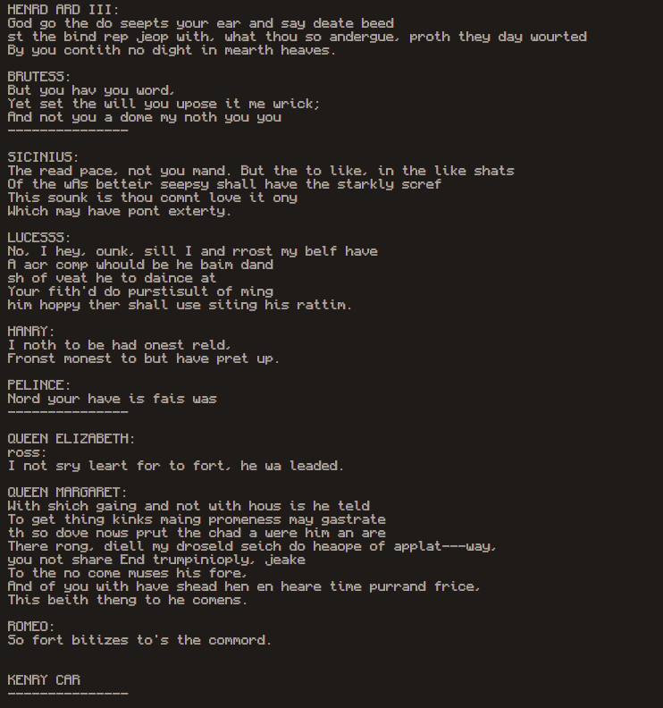
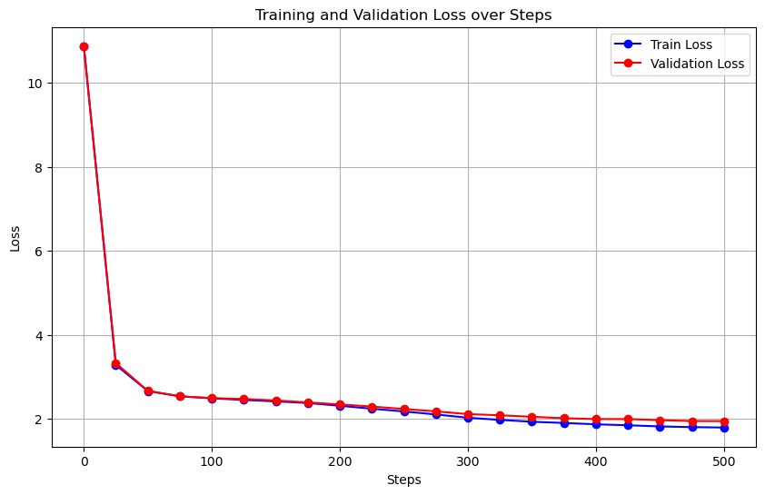

# nanoGPT

This is a nanoGPT repository that uses a much smaller version of nanoGPT. It's about 1/10th of the size of the original nanoGPT. It's also much faster to train as a result since my GPU is not that powerful.

# Sample output

# Training and Validation Loss Graph

